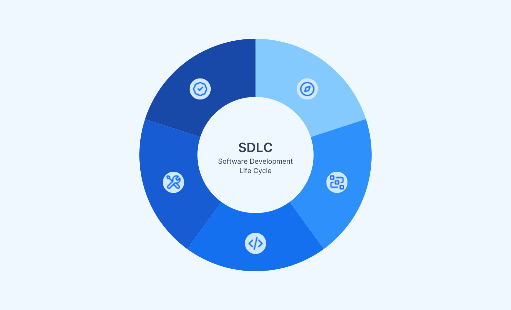

# SDLC

> Building great software is a big challenge, and development teams rely on the software development lifecycle (SDLC) to help them succeed.

## What is the SDLC?

<figure><figcaption></figcaption></figure>

### SDLC defined 

SDLC stands for software development lifecycle, it is a step-by-step structured process that helps development teams efficiently build high quality software at a lower cost. Teams use the SDLC to systematically plan, analyze, design, test, deploy, and maintain software. By following this process, teams ensure that the software meets stakeholder requirements and adheres to their organization’s standards for quality, security, and compliance.

### The Software Development Lifecycle phases and how they work 

Each phase of the SDLC has key activities designed to drive efficiently, quality, and customer satisfaction.

#### Phase 1: Requirements gathering and analysis 

Accurate, complete, and measurable user requirements are the foundation for any successful SDLC project—to ensure that the software meets user expectations and to avoid costly rework and project delays. The IT business analyst:

* Gathers requirements by conducting interviews, holding workshops or focus groups, preparing surveys or questionnaires, and observing how stakeholders work.
* Evaluates the requirements as they relate to system feasibility, and software design and testing.
* Models the requirements and records them in a document, such as a user story, software requirements specification, use case document, or process specification.

#### Phase 2: System design 

Effective system design properly accounts for all documented requirements. In this phase, software architects use tools to visualize information about the application’s behavior and structure, including:

* The unified modeling language (UML) to illustrate the software’s architectural blueprints in a diagram.
* Data flow diagrams to visualize system requirements.
* Decision trees and decision tables to help explain complex relationships.
* Simulations to predict how the software will perform.

To support the distinct layers within a software application, software architects use a design principle called separation of concerns. A software program that’s designed to align with the separation of concerns principle is called a modular program.

Modular software design separates program functionality into interchangeable, independent modules, so that each module contains everything it needs to execute one aspect of the software’s functionality. This approach makes it easier to understand, test, maintain, reuse, scale, and refactor code.

#### Phase 3: Coding 

In the coding phase, developers translate the system design specifications into actual code. It’s critical that developers follow best practices for writing clean, maintainable, and efficient code, including:

* Writing code that’s easy to understand and read.
* Using comments to explain what the code does.
* Using version control to track any changes to the codebase.
* Refactoring the code if needed.
* Conducting a code review when coding is completed to get a second opinion on the code.
* Providing code documentation that explains how the code works.

#### Phase 4: Testing 

Before it’s released to production, the software is thoroughly tested for defects and errors.

* The software test plan provides critical information about the testing process, including the strategy, objectives, required resources, deliverables, and criteria for exit or suspension.
* Test case design establishes the criteria for determining if the software is working correctly or not.
* Test execution is the process of running the test to identify any bugs or software defects.

Developers and quality assurance teams use automated testing tools to quickly test software, prepare defect reports, and compare testing results with expected outcomes. Automated testing saves time and money, provides immediate feedback, and helps improve software quality. Automated testing can be used for:

* Unit testing: Developers test the individual software modules to validate that each one is working correctly.
* Integration testing: Developers test how the different modules interact with each other to verify that they work together correctly.
* System testing: Developers test the software to verify that it meets the requirements and works correctly in the production environment.
* User acceptance testing: Stakeholders and users test the software to verify and accept it before it’s deployed to production.

#### Phase 5: Deployment 

There are three main phases to deploying software in a production environment:

* The development team commits the code to a software repository.
* The deployment automation tool triggers a series of tests.
* The software is deployed to production and made available to users.

Effective software installation requires a consistent deployment mechanism and a simple installation structure with minimal file distribution. The team must also make sure that the correct configuration file is copied to the production environment and that the correct network protocols are in place. Before migrating data to the new system, the team also needs to audit the source data and resolve any issues.

Release management makes software deployment smooth and stable. This process is used to plan, design, schedule, test, and deploy the release. Versioning helps ensure the integrity of the production environment when upgrades are deployed.

#### Phase 6: Maintenance and support 

After the software is deployed, the software maintenance lifecycle begins. Software requires ongoing maintenance to ensure that it operates at peak performance. Developers periodically issue software patches to fix bugs in the software and resolve any security issues.

Maintenance activities also include performance monitoring of both the software’s technical performance and how users perceive its performance. Providing training and documentation to users, along with addressing user issues and upgrading their systems to make sure they’re compatible with the new software, are also key components of the software maintenance lifecycle.

### SDLC methodologies 

In the world of software development, different methodologies serve as structured approaches to guide the process of creating and delivering software. These methodologies shape how teams plan, execute, and manage their projects, impacting factors such as flexibility, collaboration, and efficiency. Let's take a look at some of the more prominent SDLC methodologies.

#### Waterfall methodology 

The waterfall methodology works best for small projects where the requirements are well-defined, and the development team understands the technology. Updating existing software and migrating software to a new platform are examples of scenarios that are well-suited for the waterfall model.

Advantages of the Waterfall methodology

* The straightforward process is easy to understand and follow.
* An output is delivered at the end of each phase.
* Project milestones and deadlines are clearly defined.

Disadvantages of Waterfall methodology

* Lack of flexibility makes it difficult for development teams to adapt when stakeholder requirements change.
* Once a phase is completed, any changes can be costly to implement and might delay the project schedule.
* Testing does not take place until the end of the SDLC.

#### Agile methodology 

The agile methodology is well-suited for projects that require flexibility and the ability to quickly adapt to changing requirements. Because it encourages collaboration, agile is also well-suited for complex projects where many teams work together.

Advantages of the Agile methodology

* Stakeholders and users can provide feedback throughout the SDLC, making it easier for developers to build software that meets their needs.
* Incremental delivery helps development teams identify and fix issues early in the project before they become major problems.
* Cost savings might be realized by reducing the amount of rework required to fix issues.
* Retrospectives provide an opportunity for teams to continuously improve the process.

Disadvantages of Agile methodology

* Requirements must be clearly defined in the user story. If not, the project can quickly derail.
* Too much user feedback might change the scope of the project, cause delays, or make it difficult to manage.
* Incremental deliverables can make it difficult to determine how long it will take to finish the entire project.

#### Other popular SDLC methodologies 

* The iterative model emphasizes continuous feedback and incremental progress. It organizes the development process into small cycles where developers make frequent, incremental changes to continuously learn and avoid costly mistakes. The iterative model is well-suited for large projects that can be divided into smaller pieces, and for projects where the requirements are clearly defined from the start.
* The spiral model combines the iterative and waterfall models. It takes an evolutionary approach where developers iteratively develop, test, and refine the software in successive cycles, or spirals. Large, complex, and costly projects are well-suited for this model.
* The v-shaped model emphasizes testing and validation in a sequential process. This model is very useful for projects in industries like healthcare, where thorough testing is critical.
* The lean model focuses on increasing efficiency throughout the development process. This model takes an iterative approach and is well-suited for projects where achieving short-term goals is a priority and when there’s frequent interaction between the development team and users.

### SDLC best practices and challenges 

The biggest challenges to a successful SDLC often stem from inadequate communication, planning, testing, or documentation. Best practices to address these issues include:

* Collaboration between the development team, IT operations, the security team, and stakeholders.
* Clearly defining user requirements and project deliverables, timelines, and milestones.
* Detailed documentation of resources, schedules, code, and other deliverables.
* Daily scrum meetings to identify and resolve issues.
* Retrospectives to drive continuous improvement across the SDLC.

### How does SDLC address security? 

Due to increasing cyberattacks and security breaches, development teams are under pressure to improve application security. SDLC security is a set of processes that incorporate robust security measures and testing into the SDLC. Best practices support the detection and remediation of security issues early in the lifecycle—before the software is deployed to production. Some teams are using development platforms that build security analysis into their workflow. For example, the GitHub platform scans code for security issues as it’s written in the coding phase.

### How can DevOps be integrated into SDLC? 

DevOps is an approach to SDLC that combines development (dev) and operations (ops) to speed the delivery of quality software. The core principles of this approach are automation, security, and continuous integration and continuous delivery (CI/CD), which combines the SDLC into one integrated workflow.

DevOps follows the lean and agile SDLC methodologies and emphasizes collaboration. Throughout the entire SDLC, developers, IT operations staff, and security teams regularly communicate and work together to ensure successful project delivery.

### Conclusion 

A well-structured SDLC helps development teams deliver high-quality software faster and more efficiently. Although SDLC methods vary by organization, most development teams use SDLC to guide their projects.

The SDLC helps development teams build software that meets user requirements and is well-tested, highly secure, and production ready.&#x20;
